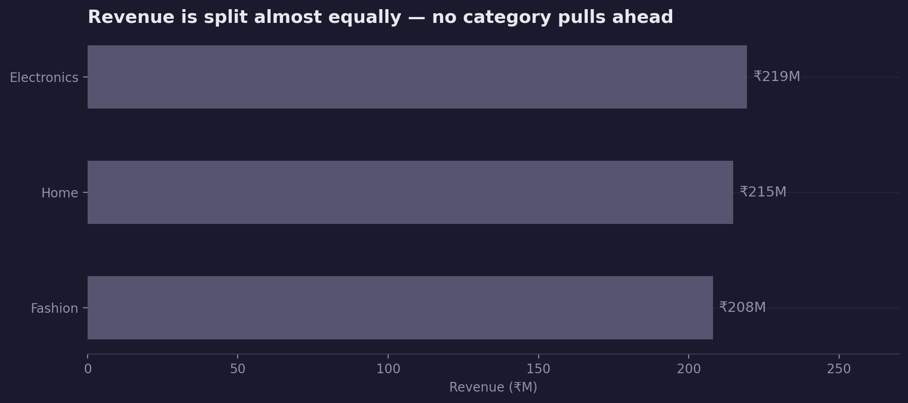
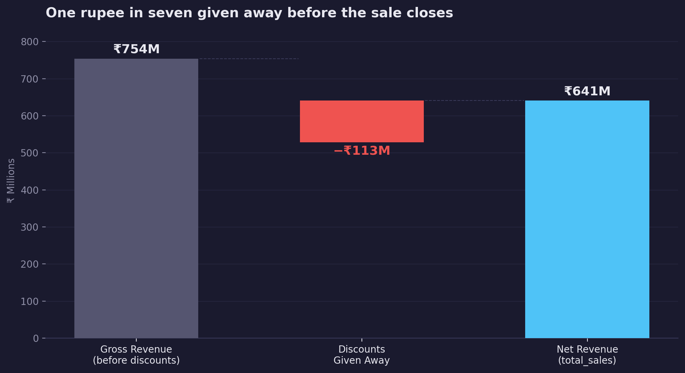
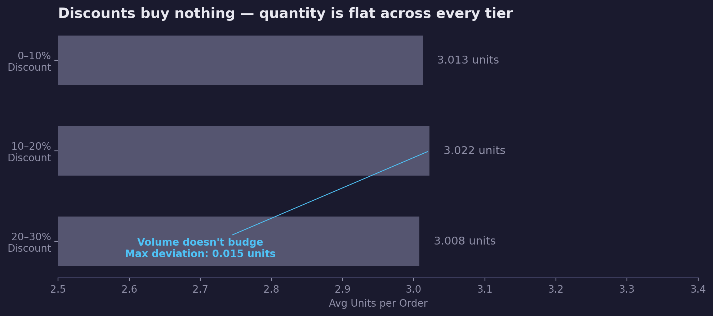
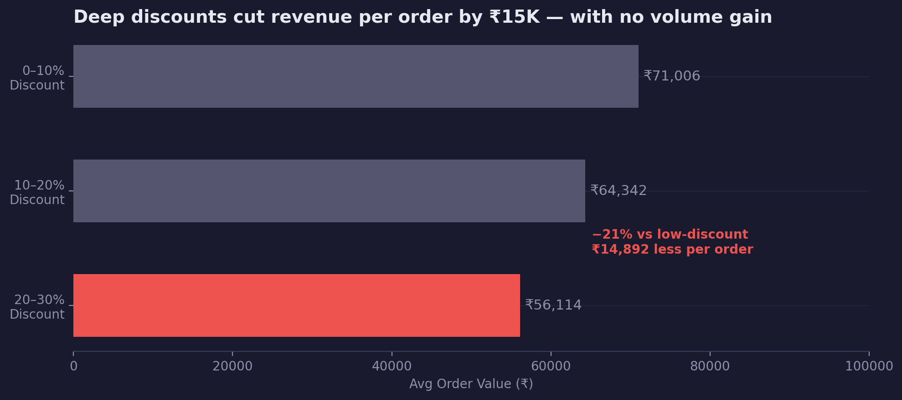
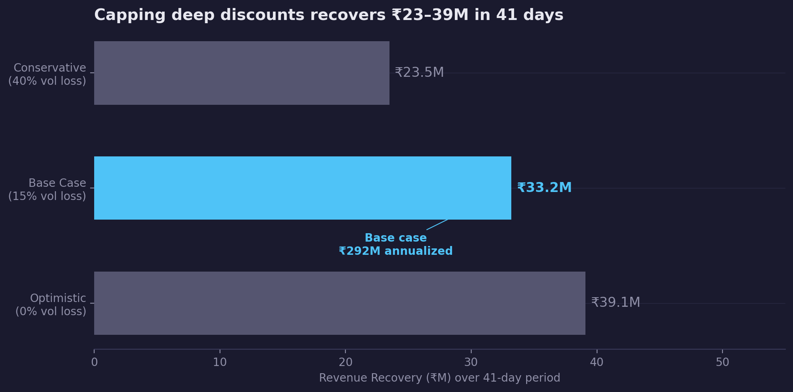
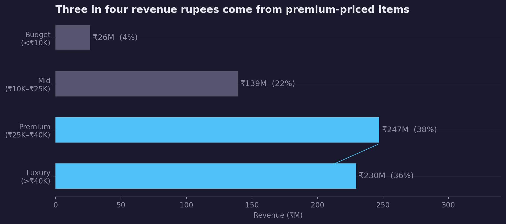

<!-- _class: title -->

# Amazon India Sales Performance
## The Hidden Cost of Discounting

February 2026 | AI Analytics System

---

<!-- _class: section -->

# Context
### ₹642M in sales across 10,000 orders — January through mid-February 2026

---

# ₹642M in sales, 10,000 orders — Jan through mid-Feb 2026

This analysis covers all 10,000 Amazon India orders placed between January 1 and February 10, 2026 — 41 days of complete, verified data. Total revenue: **₹642M**. Average order value: **₹64,213**. Revenue is distributed across three categories and seven sub-categories, with all financial metrics independently verified.

| Metric | Value |
|---|---|
| Total Revenue | ₹642.1M |
| Total Orders | 10,000 |
| Avg Order Value | ₹64,213 |
| Avg Units per Order | 3.01 |
| Avg Discount Rate | 15.0% |
| Period | Jan 1 – Feb 10, 2026 |

<!-- Speaker notes: Set context quickly. Emphasize that financials are verified — total_sales formula confirmed exact to the rupee. The audience may be surprised by how uniform the numbers look across categories; that's the setup for the tension that follows. Don't over-explain this slide — move on in under 90 seconds. -->

---

# No single category dominates — all three are within 2%

Electronics leads at 34.2% of revenue (₹219M), followed by Home (33.4%) and Fashion (32.4%). The gap between first and last is 1.8 percentage points. Within categories, Furniture leads sub-categories at ₹112M. No concentration risk — and no single category to credit or blame for performance variation.

<!-- Speaker notes: The uniformity is real — and it raises the question: if categories are equal, what IS creating variation? The answer is discounting. This slide is the setup for the tension that follows. If the audience wants to discuss category strategy here, redirect them: "What's more interesting is what's happening beneath the categories — let me show you." -->

---

<!-- _class: section -->

# The Discount Problem
### ₹113M given away — with nothing to show for it

---

# One rupee in seven was discounted away before the sale closed

Against ₹754M in gross potential revenue, Amazon India gave ₹112.9M in discounts — retaining just 85 cents of every gross rupee. The average discount rate was 15%, applied uniformly across all categories. Orders are distributed roughly equally across three tiers: 0–10%, 10–20%, and 20–30% discount.

<!-- Speaker notes: The ₹113M number should land with impact. Let a beat of silence before moving on. The natural audience reaction is: "But did those discounts drive orders?" — that's exactly what the next slide answers. Don't answer the question yet. Create the tension. -->

---

# Discounts buy nothing — quantity is flat across every tier

Across every discount tier, the average number of items per order is identical: 3.013 at 0–10% discount, 3.022 at 10–20%, and 3.008 at 20–30%. The maximum deviation across all buckets is 0.015 units — statistically indistinguishable from zero. Customers ordering at 28% discount put the same number of items in their cart as customers at 5% discount.

<!-- Speaker notes: This is the pivot point. If discounts drove volume, they would be defensible — that's the classic justification for promotional pricing. But here, volume is flat. The same customer buys 3 items regardless of discount depth. The price they pay is just lower. Let the chart speak — it's visually striking precisely because all three bars are the same height. -->

---

# Deep discounts cut revenue per order by ₹15K — with no volume gain

Average order value falls monotonically with discount depth: ₹71,006 at 0–10%, ₹64,342 at 10–20%, and ₹56,114 at 20–30% — a ₹14,892 drop, or 21% lower revenue per order in the highest discount tier. This pattern holds in every category. There is no segment where deep discounts sustain revenue per order.

<!-- Speaker notes: The Simpson's Paradox check has been run — this declining AOV pattern is consistent across Electronics, Fashion, and Home. It is not a mix effect. A common objection: "Maybe the 20–30% discount orders have lower unit prices?" Not the case — unit price distributions across discount buckets are similar. This is not deliberate premium-item promotional pricing. It's undifferentiated discounting. -->

---

<!-- _class: section -->

# The Opportunity
### ₹23–39M in recoverable revenue — no new customers required

---

# Capping deep discounts recovers ₹23–39M in 41 days

The 3,162 orders in the 20–30% discount tier would generate ₹39.1M more revenue if repriced to 10% discount — assuming zero volume loss. Under a conservative scenario with 40% volume loss, recovery is still ₹23.5M. The base case (15% volume loss) is ₹33.2M. The volume data supports the base case: discount depth shows no correlation with units ordered.

<!-- Speaker notes: The base case of ₹33.2M uses a 15% volume loss assumption. This is deliberately conservative — the volume data suggests most demand is inelastic at these price points. The right way to validate this is an A/B test (Recommendation 2). The ₹39.1M upper bound assumes perfect inelasticity — use this number only if the audience presses for the maximum; lead with ₹33.2M as the defensible figure. -->

---

# Three in four revenue rupees come from premium-priced items

Premium (₹25K–₹40K unit price) and Luxury (>₹40K) segments together generate 74.2% of total revenue — ₹477M of ₹642M — with average order values of ₹83K and ₹115K respectively. The Budget segment (<₹10K) generates only 4.1% of revenue. Deep discounting on high-ticket items accelerates the revenue erosion: a 25% discount on a ₹45K item costs ₹11,250 per unit before quantities compound.

<!-- Speaker notes: The asymmetry is the key message: discounting affects high-value items disproportionately in rupee terms. A 25% discount on a ₹500 item costs ₹125. The same rate on a ₹45,000 Laptop costs ₹11,250. The recommendation to eliminate deep discounts on Premium/Luxury items is therefore the highest-priority action — it has the largest absolute rupee impact per order. -->

---

<!-- _class: section -->

# What We Do About It
### Two decisions. One 30-day timeline.

---

# Cap deep discounts and run a controlled test

**Recommendation 1: Remove the 20–30% discount tier for Premium and Luxury items**

These items drive 74% of revenue. Volume data shows no discount elasticity. Each percentage point of unnecessary discount on a ₹40K+ item costs ₹400–₹500 per unit.

- **Decision owner:** Head of Pricing / Commercial Director
- **Success metric:** AOV for Premium/Luxury segment increases from ₹89K to ≥₹95K within 30 days
- **Timeline:** Policy update within 14 days; monitor weekly AOV for 30 days
- **Confidence:** Medium — elasticity assumed low based on volume data; unconfirmed
- **Key risk:** Monitor weekly order count; if Premium/Luxury volume drops >10%, pause and investigate

---

# Run a 30-day A/B test to validate elasticity on all tiers

**Recommendation 2: A/B test — cap 20–30% discount at 10% for 50% of eligible orders**

The elasticity question must be resolved before a full policy rollout. The test answers it directly: same customers, same period, different discount ceiling.

- **Decision owner:** Head of Growth / Analytics team
- **Success metric:** Test group revenue per order ≥₹68K (vs ₹56K control); volume loss <10%
- **Timeline:** Test design complete in 7 days; test runs 30 days; decision at day 37
- **Confidence:** High — test design is straightforward; sample size (1,581 orders per arm) is sufficient
- **Key risk:** Stratify by category to ensure balanced assignment; avoid spillover between test and control

<!-- Speaker notes: The goal of these two slides is two names and two dates. Who is making the pricing change for Premium/Luxury items, and by when? Who is owning the A/B test design, and what is the launch date? The analysis has done its job — the ₹33–39M recovery opportunity is on the table. The work remaining is a 30-day test. -->

---

# Next Steps

| Action | Owner | Deadline |
|---|---|---|
| Remove 20–30% discount tier for Premium/Luxury items | Head of Pricing | Mar 6, 2026 |
| Design A/B test protocol (50/50 split, 30 days) | Analytics Lead | Feb 27, 2026 |
| Launch A/B test | Growth Team | Mar 2, 2026 |
| Read test results and make full rollout decision | Commercial Director | Apr 3, 2026 |
| Report back on Premium/Luxury AOV movement | Analytics Lead | Mar 20, 2026 |

**Total opportunity on the table: ₹23–39M over the next 41-day equivalent period (base case: ₹33.2M)**

<!-- Speaker notes: Leave this slide up while you close the session. Ask for explicit confirmation of two owners: the pricing policy owner for Recommendation 1, and the analytics lead for the A/B test. Don't leave the room without names attached to the first two actions. -->

---

<!-- _class: appendix -->

# Appendix

---

# Data Quality Notes

| Issue | Severity | Impact on This Analysis |
|---|---|---|
| 49.1% of ship/delivery dates precede order date | High | Logistics metrics excluded; revenue analysis uses order_date only — unaffected |
| Product names are placeholder text ("without", "school", "I") | Medium | Product-level analysis impossible; sub_category used throughout |
| Country = "India" but states are US state names | Medium | State-level geography unreliable; excluded from all findings |
| Quantity and payment method distributions are perfectly uniform | Low | Likely synthetic data; does not affect revenue or discount analysis |
| February data covers only 10 of 28 days | Low | MoM comparisons use daily averages; raw Feb total not compared to Jan total |
| Only one order_status value ("Delivered") | Low | No returns, cancellations, or funnel analysis possible |

All financial metrics (total_sales formula, totals, averages) independently verified and confirmed exact.

---

# Category × Discount Deep Dive

AOV by category and discount bucket — confirming the pattern is not a mix effect:

| Category | 0–10% Disc | 10–20% Disc | 20–30% Disc | Decline |
|---|---|---|---|---|
| Electronics | ₹72,247 | ₹65,675 | ₹57,809 | −20.0% |
| Fashion | ₹70,251 | ₹65,209 | ₹54,419 | −22.5% |
| Home | ₹71,776 | ₹62,185 | ₹56,048 | −21.9% |

**All three categories show the same monotonic decline.** The aggregate finding is not driven by category mix shifts. Simpson's Paradox check: passed.

---

# Sub-Category Revenue Breakdown

| Sub-Category | Category | Revenue | % of Total | Avg Order Value |
|---|---|---|---|---|
| Furniture | Home | ₹111.8M | 17.4% | ₹64,352 |
| Footwear | Fashion | ₹104.0M | 16.2% | ₹62,167 |
| Clothing | Fashion | ₹104.0M | 16.2% | ₹65,165 |
| Kitchen | Home | ₹102.9M | 16.0% | ₹62,718 |
| Laptop | Electronics | ₹74.7M | 11.6% | ₹66,781 |
| Mobile | Electronics | ₹74.3M | 11.6% | ₹64,875 |
| Accessories | Electronics | ₹70.4M | 11.0% | ₹64,659 |

Furniture leads by revenue volume (highest order count); Laptop leads by AOV. Electronics sub-categories have marginally higher AOV than Home and Fashion sub-categories.

---

# Price Tier Definition and Revenue Summary

| Price Tier | Unit Price Range | Orders | Revenue | Avg Order Value | % of Revenue |
|---|---|---|---|---|---|
| Budget | <₹10,000 | 1,954 | ₹26.4M | ₹13,498 | 4.1% |
| Mid | ₹10K–₹25K | 3,070 | ₹139.1M | ₹45,321 | 21.7% |
| Premium | ₹25K–₹40K | 2,975 | ₹247.2M | ₹83,082 | 38.5% |
| Luxury | >₹40K | 2,001 | ₹229.5M | ₹114,668 | 35.7% |

Premium + Luxury combined: **74.2% of revenue** from **49.8% of orders** — above-proportionate revenue contribution confirms premium mix is the performance engine.
