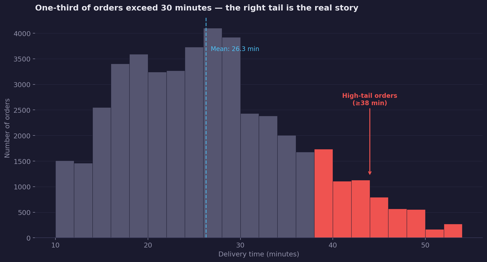
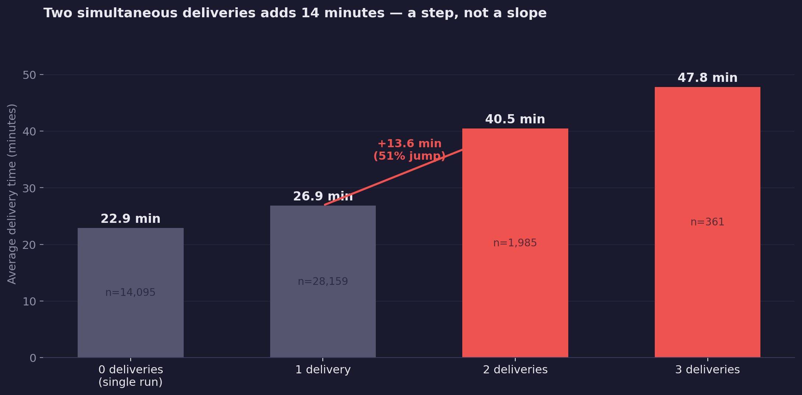
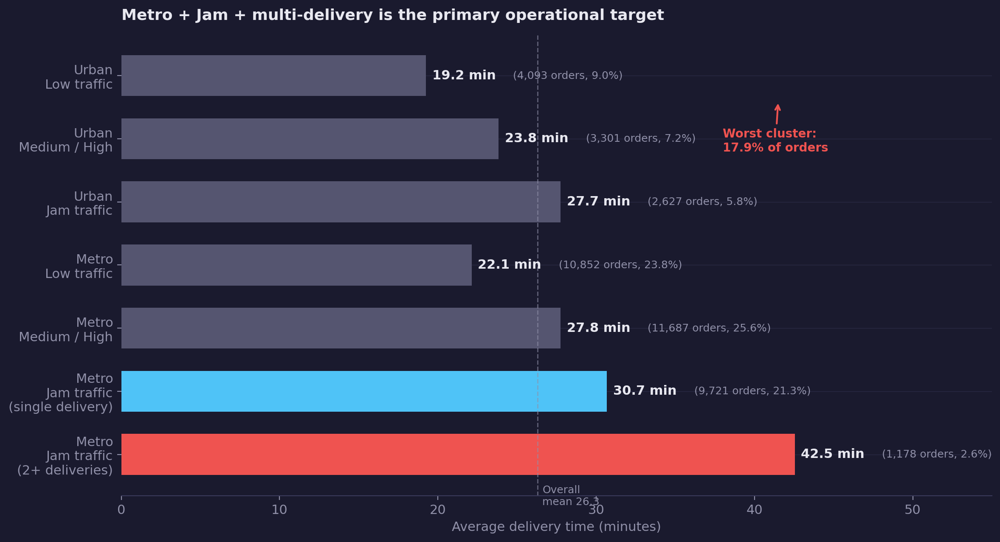
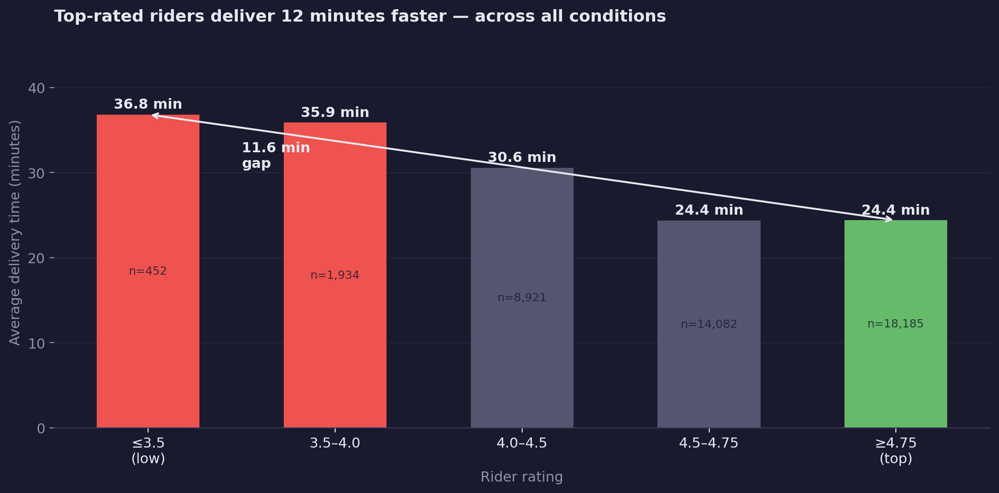
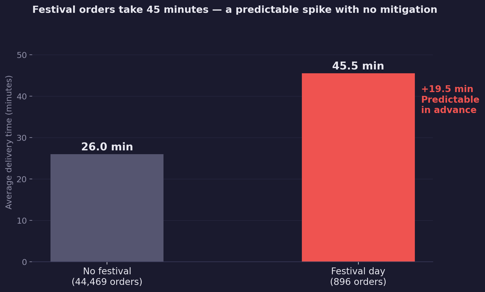
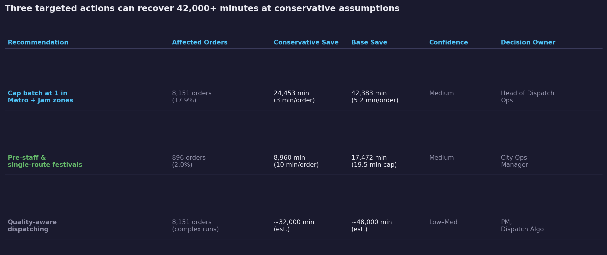

<!-- _class: title -->

# Food Delivery Performance
## What drives delivery time — and where the gap is

February–April 2022 | AI Analytics System | 19 Feb 2026

---

<!-- _class: section -->

# Context
### 45,593 orders across Indian cities. One headline metric. What's underneath it?

---

# 45,500 deliveries, 26 minutes average — the surface looks fine

The headline metric — average delivery time — sits at 26.3 minutes. Acceptable on the surface. But delivery times in this dataset run from 10 minutes to 54 minutes. The distribution isn't centred. There's a right tail, and it matters.

<!-- Speaker notes: Set the stage quickly. The 26-minute average is the number the audience probably knows. The job of this slide is to create just enough unease to make them want to see what's underneath. Don't linger — you want them asking "what's driving the variation?" within 30 seconds. -->

---

<!-- _class: section -->

# The drivers
### Three factors account for most of the variation. Two are at least partially controllable.

---

# Jam traffic adds 10 minutes — and it hits 31% of all orders

Traffic density is the single strongest predictor of delivery time. Orders in Jam conditions average 31.2 minutes — 9.9 minutes longer than Low traffic (21.3 min). This isn't a tail event. Jam is the second most common traffic state in the dataset, affecting nearly a third of all orders.

<!-- Speaker notes: The Simpson's Paradox check is already done — this pattern holds within both Urban and Metropolitan cities, so it's not a city-mix artifact. If someone asks: "Is this just because Metro orders happen in Jam more often?" — yes, but the within-Metro Jam effect is equally strong (Metro/Jam = 31.9 min vs Metro/Low = 22.1 min). Direction doesn't change. -->

---

# Two simultaneous deliveries adds 14 minutes — a step, not a slope

Multiple deliveries per run show a non-linear threshold: moving from 1 to 2 orders per run adds 13.6 minutes — a 51% jump. Three deliveries average 47.8 minutes. This isn't a continuous trade-off. It's a constraint. And it's fully within operations' control.

<!-- Speaker notes: The "why" behind the step-function is routing: a rider completing two drop-offs must fully complete the first delivery before reaching the second. The compounding wait time at both ends drives the jump. The implication: batching 2+ deliveries in high-complexity conditions is not a capacity gain — it's a guaranteed time penalty for at least one customer. -->

---

# One in five orders sits in the worst combination

Metropolitan city + Jam traffic + batching = 17.9% of all orders (8,151). Average delivery time in this segment: 33.1 minutes — 7 minutes above the overall mean, and nearly double what the same rider achieves on a single run in low traffic (17.4 min).

<!-- Speaker notes: This is the "so what" moment. The business has a 26-minute average because Metro/Low/single-delivery orders (20 min) are pulling the mean down against this 33-minute cluster. The question to raise: "Do your routing and dispatch systems treat these conditions differently today?" In most standard delivery systems: no. -->

---

# Top-rated riders deliver 12 minutes faster — and they're not selectively assigned

Rider rating correlates meaningfully with delivery time (r = −0.34). Top-rated riders (≥4.75) average 24.4 minutes. Low-rated riders (≤3.5) average 36.0 minutes — an 11.6-minute gap. In the absence of quality-aware dispatching, low-rated riders are equally likely to be assigned to the hardest routes.

<!-- Speaker notes: Correlation, not causation — better riders may self-select into easier conditions, or lower-rated riders are newer and still learning routes. Either way, the operational implication is the same: quality-aware dispatching (prioritising high-rated riders for complex multi-stop runs in congested areas) is a lever that costs nothing in infrastructure. -->

---

# Festival orders take 45 minutes — a predictable spike with no visible mitigation

Festival orders average 45.5 minutes: 19.5 minutes above the non-festival baseline. Unlike weather or traffic, festivals are knowable in advance. These 896 orders are predictable from the public calendar. The data shows no flattening of this spike — suggesting no structured pre-staffing or routing adjustment is currently in place.

<!-- Speaker notes: 896 orders is 2% of the dataset, so total volume impact is modest. But the per-customer experience during festivals is severe: a customer who normally gets their order in 26 minutes waits 45 minutes. These are often high-intent orders (celebrations, gatherings) with higher basket sizes. The reputational cost of a 45-minute festival delivery likely exceeds the operational cost of a targeted pre-staffing response. -->

---

<!-- _class: section -->

# What we should do
### Three levers. One priority order. A conservative 42,000 minutes to recover.

---

# Cap batching, pre-staff festivals, and match riders to conditions

Three targeted changes can recover the majority of the identified gap without capital investment in infrastructure. The primary lever — capping batch size in Metro + Jam conditions — addresses the segment responsible for the largest total time loss.

<!-- Speaker notes: The goal of this slide is a decision, not a discussion. Ask the room: which of these three can we move on this quarter? Rec 1 and Rec 2 are low-infrastructure changes — dispatching rules and staffing protocols. Rec 3 requires algorithm work but has the largest potential upside if the correlation reflects genuine skill differences rather than route self-selection. The 42,000-minute figure is conservative (3 min/order for the primary recommendation). Base case is 5.2 min/order × 8,151 orders. -->

---

## Recommendation 1 — Cap batch size at 1 for Metro + Jam

**Action:** In Metropolitan cities under Jam traffic conditions, dispatch routing should enforce a maximum of 1 delivery per run.

| Field | Detail |
|---|---|
| **Decision owner** | Head of Dispatch Operations |
| **Success metric** | Metro/Jam avg delivery time: 31.9 min → ≤28 min within 60 days |
| **Timeline** | Implement in dispatch logic within 30 days |
| **Confidence** | Medium |
| **Key risk** | Rider utilisation may drop in Metro/Jam zones at peak; model capacity impact before full rollout |

---

## Recommendation 2 — Pre-staff and single-route festival orders

**Action:** Define a festival calendar trigger; during festival periods, route all orders as singles and increase rider capacity in impacted cities.

| Field | Detail |
|---|---|
| **Decision owner** | City Operations Manager |
| **Success metric** | Festival order avg delivery time: 45.5 min → ≤35 min in next festival period |
| **Timeline** | Define festival criteria in 14 days; pilot in one city at next event |
| **Confidence** | Medium |
| **Key risk** | Festival definitions vary by city; require city-level calendar input |

---

## Recommendation 3 — Implement quality-aware dispatching for complex runs

**Action:** Prioritise riders rated ≥4.5 for Metro + Jam + multi-delivery assignments; monitor routing fairness for lower-rated riders.

| Field | Detail |
|---|---|
| **Decision owner** | Product Manager, Dispatch Algorithms |
| **Success metric** | Avg rider rating in Metro/Jam/multi segment: current mix → ≥4.5 within 45 days |
| **Timeline** | Algorithm update within 45 days |
| **Confidence** | Low–Medium (pilot recommended before full rollout) |
| **Key risk** | High-rated rider availability may not match Metro/Jam peak demand timing |

---

<!-- _class: appendix -->

# Appendix

---

## Data profile and quality notes

| Field | Detail |
|---|---|
| **Dataset** | Food delivery orders, India |
| **Date range** | 11 Feb – 6 Apr 2022 (44 distinct days) |
| **Rows** | 45,593 |
| **Grain** | One row = one delivery order |
| **Null rates** | Age: 4.1%, Ratings: 4.2%, Traffic: 1.3%, City: 2.6% — all manageable |
| **Data quality verdict** | 🟡 Caution — 98.7% of rows clean; Semi-Urban excluded (n=164, statistically insufficient) |
| **Key cleaning steps** | Stripped whitespace from all categoricals; replaced string "NaN" with null; extracted numeric time from `(min) XX` format |

---

## Finding not in main deck: Vehicle type confound

Motorcycles show a higher average delivery time (27.6 min) than scooters/electric scooters (~24.5 min) — counter-intuitive at first. However, motorcycles represent 58% of all riders and are disproportionately deployed in Metropolitan + high-traffic zones. Within each city-traffic combination, vehicle type explains negligible additional variance. **This is a city-routing mix effect, not a vehicle capability finding.** No vehicle recommendation is warranted from this data.

---

## Finding not in main deck: Alternating daily pattern

The dataset shows a perfectly alternating day-level pattern: 22 "fast days" averaging 23.3 minutes and 22 "slow days" averaging 29.9 minutes — with no intermediate days. This is driven by traffic composition differences (Jam = 43% of orders on slow days vs 21% on fast days) and batching depth (2+ deliveries = 9% vs 2%). This structural variation is captured by the main findings; it does not change the recommendations.

---

## Hypothesis register — final status

| # | Hypothesis | Status | Evidence |
|---|---|---|---|
| H1 | Metro cities have longer delivery times | ✅ Confirmed | Metro = 27.3 min vs Urban = 23.0 min |
| H2 | Jam traffic adds significant time | ✅ Confirmed | +9.9 min vs Low; consistent within both cities |
| H3 | Bad weather adds delivery time | ⚠️ Partial | Cloudy/Fog = 28.9 min vs Sunny = 21.9 min; but Stormy = 25.9 min (no spike) |
| H4 | Multiple deliveries increase time | ✅ Confirmed | Step-change at 2 deliveries: +13.6 min |
| H5 | Festival periods slow delivery | ✅ Confirmed | +19.5 min during festivals |
| H6 | Motorcycles are faster | ❌ Rejected | Motorcycles are SLOWER; confounded by city-routing mix |
| H7 | Low-rated riders deliver slower | ✅ Confirmed | 11.6 min gap; r = −0.34 |
| H8 | Data has trailing whitespace / string NaN | ✅ Confirmed | All categoricals had whitespace; "NaN" strings present in 5 columns |
